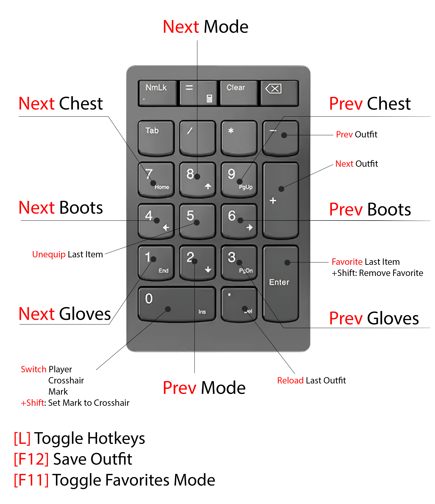

# ECLoot
Hotkey based equipment manager for Skyrim written in Papyrus. 

## Features
* Equip Items or entire Outfits on your character, Follower or any NPC quickly and **without using Menus**.
* **Create new Outfits** which are **portable between saves** and in principle should be portable between different installations as well.
* **Mark Items as Favorites** and Cycle through them at will using Hotkeys.
* **Cycle through items based on their slot**. For example, you can go through all of your base armors or cycle through all of your boots.
* Set a **Mark** on any NPC and equip items or entire outfits directly onto your mark.
* ECLoot makes heavy use of the **Numpad** to provide a logical method of cycling through items. 
  If you (like me) do not have a Numpad on your keyboard, you can use the provided [AutoHotkey](https://github.com/AutoHotkey/AutoHotkey/releases/tag/v1.1.37.02) Script to give yourself one and toggle it on demand.

## Installation
Create a new Mod in MO2 and drop the contents from this repository into it. Don't forget to activate the lightweight ECLOutfitQuest2.esp plugin, which is marked as ESL and will not take up a slot in your load order.

It's working on **SSE 1.9.57**. I need your feedback for other versions.

## Getting Started
After loading a savegame the ECL plugin will collect information about **all the equippable items found on your characters inventory**.
This can take a few seconds or a few minutes depending on how many items you are carrying. 

For example, Loading 1900 items takes around 1 minute on my machine, Loading 500 items takes less than 10 seconds.

ECL will indicate when it finished loading with an in-game notification (top left corner) that also displays how many items were loaded for each slot.
You can check the loading progress at any time by pressing the ECL Toggle key which can be setup in the MCM. (Default: [L]).
Alternatively you can check the loading progress by opening the console. The loading process must finish before ECLoot can be used.

## Controls

    ; Press [Num0] to switch between Player, Crosshair and Mark Target Mode.
    ; Use [Numpad+] and [Numpad-] to cycle forwards or backwards through your saved Outfits.
    ; [F12] Create a new outfit from the currently equipped items. It will be saved to a json file in your ECLootOutfits folder in your overwrites directory.
    ;       Note: Depending on the Mode you are in (Player, Crosshair or Mark) this saves the players items, the items of your crosshair target or the items of your mark.

    ; Equip items to your character, the corsshair target or your mark by pressing the following keys
    
    ; [L] Toggle Hotkeys Enabled/Disabled
    ; [F12] Save currently equipped Items as new Outfit
    ;   You will be prompted to provide a name for the outfit.
    ;   A json file with that name will be created in your ECLootOutfits folder in your overwrites directory.
    ; [F11] Toggle Favorite Mode
    ;   In favorites mode you cycle through all items that you have previously marked as favorite 
    ;   (instead of the items in your inventory at load time).
    ; [Num0] Switch between player, crosshair target and mark
    ;   Allows you to equip items or outfits on NPCs or on yourself.
    ; [LShift]+[Num0] Set Mark to current crosshair target (i.e. NPC under your crosshair) 
    ; [NumEnter] Mark last equipped item as a Favorite
    ; [LShift] + [NumEnter] Remove last equipped item from Favorites
    ; [Num ./DEL] Reload current outfit

    ; Note: The following table is structures like the keys on your Numpad.
    ;       It explains which keys to press to cycle the equipment on your character/crosshair target/mark.
    
    ; **Mode 1 (Chests, Boots, Gloves)**
    ; [Num7] Prev Chest     [Num8] Next Mode    [Num9] Next Chest
    ; [Num4] Prev Boots     [Num5] Undo         [Num6] Next Boots
    ; [Num1] Prev Gloves    [Num2] Prev Mode    [Num3] Next Gloves
    ; **Mode 2 (Hair, Amulet, Earring)**
    ; [Num7] Prev Hair      [Num8] Next Mode    [Num9] Next Hair
    ; [Num4] Prev Amulet    [Num5] Undo         [Num6] Next Amulet
    ; [Num1] Prev Earring   [Num2] Prev Mode    [Num3] Next Earring
    ; **Mode 3 (Ring, Circlet, Pants)**
    ; [Num7] Prev Ring      [Num8] Next Mode    [Num9] Next Ring
    ; [Num4] Prev Circlet   [Num5] Undo         [Num6] Next Circlet
    ; [Num1] Prev Pants     [Num2] Prev Mode    [Num3] Next Pants
    ; **Mode 4 (Unk1, Unk2, Unk3)**
    ; [Num7] Prev Unk1      [Num8] Next Mode    [Num9] Next Unk1
    ; [Num4] Prev Unk2      [Num5] Undo         [Num6] Next Unk2
    ; [Num1] Prev Unk3      [Num2] Prev Mode    [Num3] Next Unk3
    ; **Mode 5 (Unk4, Unk5, Unk6)**
    ; [Num7] Prev Unk4      [Num8] Next Mode    [Num9] Next Unk4
    ; [Num4] Prev Unk5      [Num5] Undo         [Num6] Next Unk5
    ; [Num1] Prev Unk6      [Num2] Prev Mode    [Num3] Next Unk6
    ; Mode 6 (Unk7, Unk8, )
    ; [Num7] Prev Unk7      [Num8] Next Mode    [Num9] Next Unk7
    ; [Num4] Prev Unk8      [Num5] Undo         [Num6] Next Unk8
    ; [Num1]                [Num2] Prev Mode    [Num3] 

## Compatibility
Should be compatible with everything as it does not touch existing records. The default hotkeys might conflict with hotkeys from other mods. Remember that you can disable/enable ECLoot Hotkeys by pressing [L]. You can change this key in the MCM.

## Supported Versions
Working on **SSE 1.9.57**

I was not able to test on other versions of the game yet. May work on other versions or may need recompiling (sources are provided). 

## Performance
Code is a bit of a mess but it works. During gameplay there is no impact. Only for a short time after loading a save.

ECLoot only processes stuff when you load a save or start a new game. Once this loading is finished there should be no further performance impact. 
ECLoot is only active when you press hotkeys to cycle equipment.

